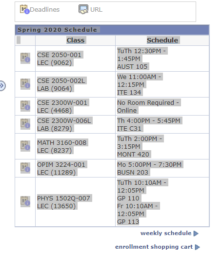

# UConn Google Calendar Scheduler
---
I came up the idea for this program when I was thinking about all the time that I spend inputting my college class schedule into my google calendar. I decided to make a program where I could copy and paste my schedule into a text file and my classes would automatically be uploaded to my google calendar. I decided to use python for this project since the google calendar api supports python and I had a class using python coming up. The user copies and pastes their class schedule from the UConn self service page and pastes it into a .txt file. When the program is run it parses the text file and outputs a .txt file containing the date, start time, end time, and location of the class. The program then parses this new text file and creates events in the users google calendar.
## How to use
1. Download the repository
2. Go to the [Google Developer Console](https://console.developers.google.com/)
3. Create a new project 
4. Enable the Google Calendar API
5. Go to credentials
6. Create credentials-OAuth client ID-Other
7. Download the Client ID and save as client_secret.json
8. Replace the client_secret.json file in the folder containing UConn_Google_Calendar_Inputter.py
9. Copy and paste your from schedule from the [UConn Self Service](https://studentadmin.uconn.edu/) site into InputFile.txt 

10. Run UConn_Google_Calendar_Inputter.py
11. Go to the generated link
12. Select and verify which gmail account you would like to use
13. Paste the verification code into the console and press enter
14. Your UConn schedule should now be in your google calendar
## Required Python Libraries
- pickle
- datefinder
- datetime
- google-api
